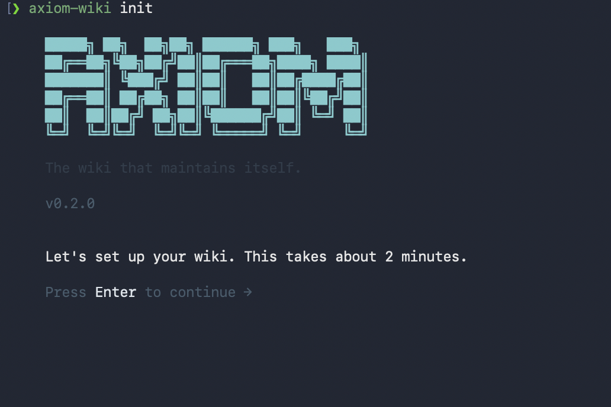

# Axiom Wiki

<p align="center">
  
</p>



**The wiki that maintains itself.**

[](https://www.npmjs.com/package/axiom-wiki)
[](https://www.elastic.co/licensing/elastic-license)
[](https://nodejs.org)

Axiom Wiki turns a folder of raw documents into a persistent, AI-maintained personal knowledge base. Unlike RAG systems that re-derive answers from raw sources on every query, Axiom compiles knowledge into an interconnected wiki of markdown pages — and keeps it current as new sources arrive.

The human curates sources and asks questions. The AI does everything else: summarising, cross-referencing, filing, updating, and maintaining consistency across all pages.

> **Inspired by** Andrej Karpathy's [llm-wiki](https://gist.github.com/karpathy/442a6bf555914893e9891c11519de94f) — the idea that LLMs should maintain a persistent, compounding wiki rather than re-derive answers from raw sources on every query.

---

## Quick Start

```bash
npm install -g axiom-wiki
axiom-wiki init
```

The setup wizard asks for your API key, wiki directory, and raw sources folder. When it's done, your wiki is live.

Or run without installing:

```bash
npx axiom-wiki init
```

Launch the interactive shell:

```bash
axiom-wiki
```

Drop a PDF or markdown file into your `raw/` folder, then run `/ingest` from the shell — or directly from the CLI:

```bash
axiom-wiki ingest
```

The agent reads the file, extracts entities and concepts, creates wiki pages, and updates the index — all automatically.

---

## Installation

```bash
npm install -g axiom-wiki
```

```bash
yarn global add axiom-wiki
```

```bash
pnpm add -g axiom-wiki
```

**Run without installing:**
```bash
npx axiom-wiki init
```

Both `axiom-wiki` and the shorthand `axwiki` are available after install.

### From source

```bash
git clone https://github.com/abubakarsiddiq/axiom-wiki.git
cd axiom-wiki
pnpm install && pnpm build
pnpm link --global
axiom-wiki init
```

### Docker

```bash
docker run -it -v $(pwd):/wiki axiomwiki/axiom-wiki init
```

---

## Supported LLM Providers

| Provider | Models | Free Tier | Get API Key |
|---|---|---|---|
| **Google Gemini** *(recommended)* | Gemini 3 Flash, 3.1 Pro, 3.1 Flash Lite, 2.5 Pro, 2.0 Flash, Gemma 4 26B/31B | Yes | [aistudio.google.com/app/apikey](https://aistudio.google.com/app/apikey) |
| **OpenAI** | GPT-5.4, GPT-5.4 Mini, GPT-5.4 Nano | No | [platform.openai.com/api-keys](https://platform.openai.com/api-keys) |
| **Anthropic** | Claude Opus 4.6, Sonnet 4.6, Haiku 4.5 | No | [console.anthropic.com/settings/keys](https://console.anthropic.com/settings/keys) |
| **Ollama** *(local, no key)* | Llama 3.2, Llama 3.1, Mistral, Qwen 2.5 | Free | [ollama.com](https://ollama.com) |

Switch provider or model at any time:

```bash
axiom-wiki model
```

---

## Interactive Shell

Run `axiom-wiki` with no arguments to enter the interactive shell — a persistent prompt where you run all commands without leaving the terminal:

```
> type /help or ask a question...
```

Type `/` to open the slash command menu. Navigate with `↑↓`, complete with `Tab` or `→`, run with `Enter`, cancel with `Esc`:

```
┌─────────────────────────────────────────────────────────┐
│ ▶ /ingest [file]     Ingest a source file into the wiki │
│   /watch             Watch raw/ and auto-ingest new files│
│   /clip [url]        Clip a URL and save it to raw/     │
│   /sources           Browse and manage ingested sources  │
│   /review            Review and resolve contradictions   │
│   /status            Show wiki statistics                │
│   /model             Switch provider or model            │
│   /lint              Wiki health check                   │
│   /help              Show all commands                   │
└─────────────────────────────────────────────────────────┘
```

Inline arguments work directly in the prompt:

```
> /ingest notes.md
> /ingest notes.md --interactive
> /clip https://example.com/article
```

Or just type a question to query your wiki directly — no slash needed:

```
> What did Alan Turing say about intelligence?
```

---

## Commands

Direct CLI commands (also available inside the interactive shell):

```
axiom-wiki                         Launch interactive shell
axiom-wiki init                    First-time setup wizard
axiom-wiki ingest [file]           Ingest a source file, or scan raw/ for new files
axiom-wiki ingest [file] --interactive  Interactive ingest with topic review
axiom-wiki query                   Interactive chat against your wiki
axiom-wiki watch                   Auto-ingest new files dropped into raw/
axiom-wiki clip [url]              Clip a URL and save it to raw/
axiom-wiki sources                 Browse and manage ingested sources
axiom-wiki review                  Review and resolve wiki contradictions
axiom-wiki model                   Switch LLM provider or model
axiom-wiki status                  Wiki statistics
axiom-wiki mcp                     Start MCP server (for Claude Code / Cursor)
```

`axwiki` is an alias for `axiom-wiki` — all commands work with either.

---

## Ingest

Ingest a specific file or scan `raw/` for anything not yet processed:

```bash
axiom-wiki ingest path/to/file.pdf
axiom-wiki ingest          # scans raw/ and ingests new files
```

While ingesting, the terminal shows live progress — each tool call the agent makes (`write_page`, `update_index`, etc.) appears as it happens, along with the files created or modified:

```
⚙ write_page({"pagePath":"wiki/pages/entities/alan-turing.md"...})
  → wiki/pages/entities/alan-turing.md written
⚙ write_page({"pagePath":"wiki/pages/concepts/turing-test.md"...})

✓ my-notes.pdf
  in=42318 out=1847  $0.0231

+ wiki/pages/entities/alan-turing.md
+ wiki/pages/concepts/turing-test.md
~ wiki/index.md
~ wiki/log.md
```

Token usage and cost are shown per file and logged to `wiki/usage.log`.

---

## Watch Mode

Automatically ingest files as they land in `raw/`:

```bash
axiom-wiki watch
```

Drop any supported file into your `raw/` folder and it is ingested within seconds. Watch mode respects `.axiomignore`, skips already-ingested files, and shows cost per file. Press `q` to stop.

---

## Web Clipper

Clip any URL directly into your wiki:

```bash
axiom-wiki clip https://example.com/article
```

Axiom fetches the page, extracts the article content via Readability (the same engine Firefox uses for Reader Mode), converts it to Markdown with frontmatter, and saves it to `raw/`. You are then prompted to ingest immediately — with the same live progress display as a normal ingest — or save it for later.

**Supported content types:**
- HTML articles — Readability extraction → Markdown with `source_url` frontmatter
- PDF URLs — direct download
- Image URLs — direct download (`.png`, `.jpg`, `.webp`)

---

## Interactive Ingest

Take control of what gets written before the agent starts:

```bash
axiom-wiki ingest notes.md --interactive
```

The agent reads the source, presents the key topics it found, and waits for your input before writing any pages:

```
Agent: I found these key topics: Alan Turing, Enigma Machine, Church-Turing Thesis.
       Any focus areas, things to skip, or framing to apply?
> Focus on the mathematics. Skip the wartime narrative.
```

After pages are written, it summarises what was created and waits for your confirmation before updating the index.

---

## Source Management

View and manage everything you have ingested:

```bash
axiom-wiki sources
```

Navigate with `↑↓`, then:

| Key | Action |
|-----|--------|
| `v` | View the source's wiki summary page |
| `r` | Mark for re-ingest (next ingest will diff) |
| `d` | Delete the source summary page |
| `q` | Quit |

**Re-ingest:** When you run `ingest` on a source that already has a wiki summary, Axiom automatically compares old and new content and only updates pages that have changed.

---

## Contradiction Resolution

Find and resolve conflicting information across sources:

```bash
axiom-wiki review
```

When ingesting, if the agent detects a conflict between sources it marks the affected page with a `⚠️ Contradiction:` block. The review screen surfaces all unresolved contradictions and proposes AI-assisted resolutions.

```
▶ entities/alan-turing.md
  ⚠️ Contradiction: notes.md says born 1912, wikipedia.md says born 1912-06-23.

AI: Both sources agree on 1912. Wikipedia provides the full date.
    I recommend "born 23 June 1912".

Apply this resolution? (Y/n/e=edit)
```

---

## Cost Tracking

Every ingest, re-ingest, and query operation logs token usage and estimated cost to `wiki/usage.log`:

```
2026-04-11T07:23:19Z | ingest | my-notes.pdf | google/gemini-3-flash-preview | in=42318 out=1847 | $0.0231
2026-04-11T08:01:05Z | ingest | article-2026-04-11.md | google/gemini-3-flash-preview | in=8204 out=921 | $0.0046
```

Cost is also shown inline after each operation in the terminal.

---

## Ollama — Run Fully Offline

Run Axiom entirely on-device with no API key:

1. Install Ollama: [ollama.com](https://ollama.com)
2. Pull a model: `ollama pull llama3.2`
3. Run `axiom-wiki init` and select **Ollama (local)**

Axiom connects to `http://localhost:11434` by default and validates the connection during setup.

**Docker + Ollama:**

```yaml
services:
  axiom-wiki:
    image: axiomwiki/axiom-wiki
    volumes:
      - ./wiki:/app/wiki
      - ./raw:/app/raw
    environment:
      - OLLAMA_BASE_URL=http://ollama:11434/api
  ollama:
    image: ollama/ollama
    volumes:
      - ollama_data:/root/.ollama
volumes:
  ollama_data:
```

---

## .axiomignore

Exclude files from watch mode and batch ingest using `.gitignore` syntax. A default `.axiomignore` is created in your `raw/` folder during `init`:

```
# axiomignore — patterns to skip during watch/ingest

# Temporary files
*.tmp
*.swp
.DS_Store
```

Add your own patterns:

```
# Ignore an archive folder
archive/

# Ignore a specific file
draft-do-not-ingest.md
```

---

## Claude Code / MCP Integration

Axiom Wiki exposes all its tools as an MCP server, so you can query and update your wiki directly from Claude Code, Cursor, or any MCP-compatible client.

**Step 1.** Start the MCP server:

```bash
axiom-wiki mcp
```

**Step 2.** Add to your Claude Code MCP config (`.claude/mcp_settings.json`):

```json
{
  "axiom-wiki": {
    "command": "axiom-wiki",
    "args": ["mcp"],
    "env": {}
  }
}
```

Or with npx (no global install required):

```json
{
  "axiom-wiki": {
    "command": "npx",
    "args": ["axiom-wiki", "mcp"],
    "env": {}
  }
}
```

**Step 3.** Restart Claude Code. Available tools:

- `read_page` — read any wiki page
- `write_page` — create or update a page
- `search_wiki` — full-text search across all pages
- `list_pages` — browse the wiki catalog
- `ingest_source` — process a raw file into the wiki
- `get_status` — wiki statistics
- `lint_wiki` — health check data
- `update_index` — rebuild the wiki index
- `append_log` — add a log entry
- `list_sources` — all ingested sources with dates
- `get_source` — read a source's wiki summary
- `remove_source` — remove a source summary page
- `get_contradictions` — find all unresolved contradiction blocks
- `resolve_contradiction` — apply a resolution to a contradiction

---

## Wiki Structure

```
my-wiki/
  raw/              ← Drop your source files here (PDF, MD, DOCX, images, HTML)
    .axiomignore    ← Patterns to exclude from watch/ingest
    assets/         ← Images and attachments
  wiki/
    pages/
      entities/     ← People, places, organisations
      concepts/     ← Ideas, topics, theories
      sources/      ← One summary page per source file
      analyses/     ← Filed answers and comparisons
    index.md        ← Catalog of all pages (agent reads this first)
    log.md          ← Append-only operation history
    usage.log       ← Token usage and cost per operation
    schema.md       ← Wiki conventions
  .axiom/
    config.json     ← Local config placeholder
```

Every wiki page uses consistent frontmatter:

```yaml
---
title: "Alan Turing"
summary: "British mathematician and pioneer of computer science"
tags: [mathematics, computing, ai]
category: entities
sources: ["turing-biography.pdf"]
updatedAt: "2026-04-10"
---
```

The `index.md` and `log.md` files are plain text — parseable with standard Unix tools:

```bash
grep "^## \[" wiki/log.md | tail -5       # last 5 operations
grep "ingest" wiki/log.md | wc -l          # total sources ingested
grep "ingest" wiki/usage.log               # cost breakdown per ingest
```

---

## Obsidian Integration

Axiom Wiki stores everything as plain markdown — Obsidian works perfectly as a viewer.

- **Open `wiki/` as your Obsidian vault** — the graph view maps the connections the agent creates between pages
- **Use Obsidian Web Clipper** to save articles as `.md` files directly to your `raw/` folder, then run `axiom-wiki ingest`
- **Dataview plugin** works out of the box with the frontmatter Axiom writes on every page — build dashboards from your wiki
- **Bind a hotkey** to "Download attachments" to localise images referenced in sources

---

## Supported File Types

| Extension | How it's processed |
|---|---|
| `.md`, `.txt` | Read as plain text |
| `.pdf` | Uploaded to the provider's Files API (Google) or sent as base64 (other providers) |
| `.png`, `.jpg`, `.jpeg`, `.webp` | Uploaded to the provider's Files API (Google) or sent as base64 (other providers) |
| `.html` | Converted to Markdown via node-html-markdown |
| `.docx` | Converted to Markdown via mammoth |

For Google Gemini, binary files (PDFs and images) are uploaded to the Google Files API before ingestion — the file bytes are hosted server-side and referenced by URI, bypassing the model's inline token limit.

---

## Docker

```bash
# Init
docker run -it -v $(pwd):/wiki axiomwiki/axiom-wiki init

# Ingest
docker run -it -v $(pwd):/wiki axiomwiki/axiom-wiki ingest

# Watch mode
docker run -it -v $(pwd):/wiki axiomwiki/axiom-wiki watch

# Query
docker run -it -v $(pwd):/wiki axiomwiki/axiom-wiki query

# MCP server
docker run -v $(pwd):/wiki axiomwiki/axiom-wiki mcp
```

Docker Compose (cloud provider):

```yaml
services:
  axiom-wiki:
    image: axiomwiki/axiom-wiki
    volumes:
      - ./my-wiki:/wiki
    environment:
      - GOOGLE_GENERATIVE_AI_API_KEY=${GOOGLE_GENERATIVE_AI_API_KEY}
```

---

## Contributing

PRs are welcome. Areas where contributions help most:

- **New file type handlers** — add support in `src/core/files.ts`
- **LLM provider integrations** — add to `src/config/models.ts` and `src/agent/index.ts`
- **CLI UX improvements** — Ink screens in `src/cli/screens/`
- **Documentation** — usage guides, examples, walkthroughs
- **Bug fixes** — open an issue first for anything non-trivial

See [CONTRIBUTING.md](CONTRIBUTING.md) for guidelines.

---

## License

[Elastic License 2.0 (ELv2)](LICENSE)

Free to use, self-host, and modify. You may not offer Axiom Wiki as a hosted or managed service to third parties without a separate commercial agreement.

*Axiom Wiki — The wiki that maintains itself.*
