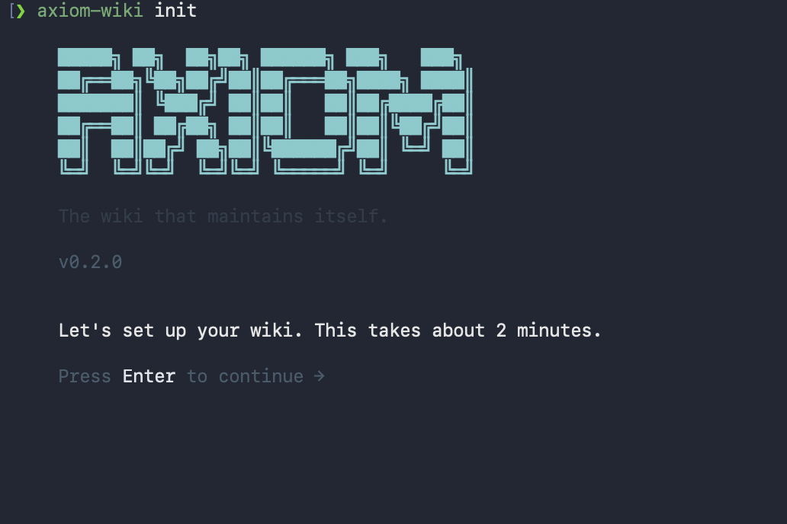

<p align="center">
  <a href="https://abubakarsiddik31.github.io/axiom-wiki">
    
  </a>
</p>

<h1 align="center">Axiom Wiki</h1>

<p align="center">
  <strong>The wiki that maintains itself.</strong><br/>
  An AI-powered knowledge compiler that transforms unstructured documents and codebases into an interconnected, self-updating Markdown wiki.
</p>

<p align="center">
  <a href="https://www.npmjs.com/package/axiom-wiki"></a>
  <a href="https://www.npmjs.com/package/axiom-wiki"></a>
  <a href="https://github.com/abubakarsiddik31/axiom-wiki/actions/workflows/ci.yml"></a>
  <a href="https://modelcontextprotocol.io"></a>
  <a href="https://obsidian.md"></a>
  <a href="https://nodejs.org">= 18" /></a>
  <a href="LICENSE"></a>
</p>

<p align="center">
  <a href="https://abubakarsiddik31.github.io/axiom-wiki"><strong>Documentation</strong></a> ·
  <a href="#quick-start"><strong>Quick Start</strong></a> ·
  <a href="#why-axiom-knowledge-compilation-vs-rag"><strong>Why Axiom?</strong></a> ·
  <a href="#key-features"><strong>Features</strong></a> ·
  <a href="#cli-commands"><strong>Commands</strong></a> ·
  <a href="#mcp-server-for-ai-agents"><strong>MCP Integration</strong></a> ·
  <a href="#supported-llm-providers"><strong>Providers</strong></a>
</p>

<br/>

<p align="center">
  
</p>

<br/>

> *"Instead of repeatedly querying a raw database with RAG, what if an AI continuously reads, extracts, synthesizes, and compiles your knowledge into a clean, cross-linked, living wiki?"*  
> — Inspired by Andrej Karpathy's [llm-wiki](https://gist.github.com/karpathy/442a6bf555914893e9891c11519de94f) thesis.

---

## Why Axiom? (Knowledge Compilation vs. RAG)

Traditional **Retrieval-Augmented Generation (RAG)** searches raw document chunks at query time and re-derives answers from scratch on every prompt. As knowledge bases grow, traditional RAG suffers from high latency, lost context, missing relationships, and silent hallucinations.

**Axiom takes a fundamentally different approach: Knowledge Compilation.**

```
   Raw Sources                                Compilation Pipeline                            Interconnected Wiki
 ┌───────────────┐                            ┌────────────────────────┐                    ┌─────────────────────────┐
 │ PDFs, Docs    │                            │ ⚡ Incremental Ingest   │                    │ 📂 pages/entities/       │
 │ Markdown      │ ─── axiom-wiki ingest ───► │ 🔗 Entity Resolution   │ ─────────────────► │ 📂 pages/concepts/       │
 │ Codebases     │     or autowiki            │ 🏷️ Cross-linking       │                    │ 📂 pages/sources/        │
 │ URLs / HTML   │                            │ 🛡️ Forensic Citations  │                    │ 📂 pages/analyses/       │
 └───────────────┘                            └────────────────────────┘                    └────────────┬────────────┘
                                                                                                         │
                                     ┌───────────────────────────────────────────────────────────────────┴────────────────────────┐
                                     ▼                                                                   ▼                        ▼
                          Interactive Terminal UI                                                  Local Web Server          MCP Server
                       • Slash-command autocomplete                                              • Full-text & vector      • Claude Code
                       • Real-time compile status                                                • Interactive SVG graph   • Cursor
                       • Grounded query mode                                                     • Backlink explorer       • Windsurf
```

| Dimension | Traditional Vector RAG | Axiom Wiki Knowledge Compilation |
| :--- | :--- | :--- |
| **Synthesis Timing** | On-demand at query time (slow, costly) | **Compiled once** at ingest time, updated incrementally |
| **Data Format** | Opaque vector embeddings in proprietary DBs | **Plain, human-readable Markdown** with YAML frontmatter |
| **Relationships** | Fragmented chunks with lost document hierarchy | **Bi-directional `[[wiki-links]]`**, backlinks & tags |
| **Verification** | Hallucinations masked within answers | **Forensic Proofs**: line, page & timestamp locators verified in CI |
| **Tool Ecosystem** | Trapped in RAG pipeline | Open in **Obsidian**, browse via **Local Web UI**, query via **MCP** |
| **Cost & Latency** | Pays LLM context costs on every query | Instant local reading; tokens spent only when sources change |

---

## Quick Start

Get your personal or project wiki running in **under 60 seconds**:

### 1. Install & Initialize
```bash
# Global installation (or use: npx axiom-wiki init)
npm install -g axiom-wiki

# Run interactive setup wizard (Scope, LLM Provider, API Key, Directories)
axiom-wiki init
```

### 2. Add Sources & Ingest
Drop PDFs, Markdown, images, DOCX, CSV/TSV, or HTML files into your `raw/` folder, then compile:
```bash
axiom-wiki ingest
```
*Or clip any web article directly:*
```bash
axiom-wiki clip https://example.com/article --ingest
```

### 3. Or Auto-Wiki an Entire Codebase
Generate architectural blueprints, module guides, and domain concepts for any project folder:
```bash
axiom-wiki autowiki
```

### 4. Explore & Query
```bash
# Launch full interactive terminal shell
axiom-wiki

# Query directly with strict zero-hallucination grounding
axiom-wiki query "How does authentication work across our microservices?" --forensic

# Launch local browser UI with interactive graph and backlinks
axiom-wiki serve --open
```

> **Tip:** You can use `axwiki` as a shorthand alias for `axiom-wiki`.

---

## Key Features

### 🤖 Autonomous Project Mapping (`autowiki` & `sync`)
Point Axiom at any codebase or document folder. An AI agent explores your file tree, plans an architecture catalog, and constructs comprehensive wiki pages in structured batches. When code evolves, `axiom-wiki sync` detects Git and content diffs to update only stale documentation.

### ⚡ Incremental Compilation & State Tracking
Source files are tracked using cryptographically secure **SHA-256 content hashes** in `state.json`. Subsequent runs skip unchanged files instantly. PID-based compilation locks guarantee concurrency safety during automated runs.

### 🛡️ Forensic Citation Proofs & Grounded Querying
Never wonder if an AI hallucinated a fact:
* **Strict Paragraph Citations:** Claims cite exact locations: pages (`^[book.pdf#p. 42]`), timestamps (`^[talk.mp4#14:20]`), lines (`^[auth.ts#L88]`), or exact quotes (`^[rfc.txt#"MUST NOT"]`).
* **Claim Grading:** Annotate claims by evidence strength (`| grade: data`, `anecdote`, `outcome`, `assertion`).
* **Deterministic Audit:** `axiom-wiki lint --forensic` mechanically verifies locators against raw source text, exiting with code `1` on invalid references. Perfect for pre-commit hooks and CI pipelines.
* **Zero-Knowledge Query Mode:** `axiom-wiki query --forensic` completely bars parametric LLM memory, answering *strictly* from verified wiki pages and raw sources.

### 🔍 Orama Hybrid Search & Heading-Aware Chunking
Combines lexical **BM25 keyword search** with dense **vector embeddings** using an embedded Orama engine:
* Automatically chunks long documents by markdown headings (`[Document > Section]`).
* Two-stage candidate deduplication and dynamic dimension probing.
* Seamless embedding support for **Google Gemini** (up to 3072d), **OpenAI** (1536d), or **Ollama** (100% offline).

### 🌐 Local Web UI & Link Graph (`serve`)
Run `axiom-wiki serve` to launch a zero-dependency, lightweight web dashboard (`http://127.0.0.1:1717`):
* **Dashboard & Metrics:** Category distributions, raw document counts, and index health.
* **Deterministic SVG Graph:** Visualize page connections, identify orphan nodes, and spot broken links.
* **"Linked From" Backlinks:** Native bi-directional backlinks on every page.
* **Read-Only Safety:** Zero write endpoints; safe for LAN sharing via `--host 0.0.0.0`.

### 🔌 Native Model Context Protocol (MCP) Server
Integrate Axiom Wiki directly with **Claude Code**, **Cursor**, **Windsurf**, or custom AI agents.
* **16 Core Agent Tools:** `read_page`, `write_page`, `search_wiki`, `ingest_source`, `get_backlinks`, `verify_citations`, and more.
* **Agent Planning Tools:** `get_architecture_brief`, `plan_with_wiki`, `check_before_commit`.
* **Ambient Context Resources:** Exposes `axiom://overview`, `axiom://index`, and `axiom://recent-changes`.
* Run `axiom-wiki setup-agent` to automatically configure your favorite developer tools.

### 💎 Obsidian Compatible & Unix-Friendly
* **Pure Markdown:** Every page is standard Markdown with clean YAML frontmatter. Open `wiki/` as an [Obsidian vault](https://abubakarsiddik31.github.io/axiom-wiki/guides/obsidian/) with full graph and tag support.
* **Maps of Content (`moc.md`):** Automatically compiled tag hierarchies.
* **Unix Pipelines:** Parse operation logs and token expenditures using standard utilities (`grep`, `tail`, `awk` on `log.md` and `usage.log`).

---

## Supported LLM Providers

Axiom Wiki supports 9 providers, from zero-cost free tiers to offline local inference:

| Provider | Supported Models | Embeddings | Free Tier | Setup Link |
| :--- | :--- | :---: | :---: | :--- |
| **Google Gemini** *(Recommended)* | `gemini-2.5-pro`, `gemini-2.5-flash` | ✅ (3072d) | **Yes** | [aistudio.google.com](https://aistudio.google.com/app/apikey) |
| **OpenAI** | `gpt-4.1`, `gpt-4o`, `gpt-4o-mini` | ✅ (1536d) | No | [platform.openai.com](https://platform.openai.com/api-keys) |
| **Anthropic** | `claude-3-7-sonnet`, `claude-3-5-haiku` | Via fallback | No | [console.anthropic.com](https://console.anthropic.com/settings/keys) |
| **Ollama** *(100% Local / Offline)* | `llama3.3`, `qwen2.5`, `mistral`, custom | ✅ (nomic/bge) | **Free** | [ollama.com](https://ollama.com) |
| **OpenRouter** | Any OpenRouter model identifier | Via fallback | **Yes** | [openrouter.ai/keys](https://openrouter.ai/keys) |
| **Groq** | `llama-3.3-70b-versatile`, `mixtral-8x7b` | Via fallback | **Yes** | [console.groq.com](https://console.groq.com/keys) |
| **DeepSeek** | `deepseek-chat`, `deepseek-reasoner` | Via fallback | No | [platform.deepseek.com](https://platform.deepseek.com/api_keys) |
| **Mistral AI** | `mistral-large`, `mistral-small` | Via fallback | No | [console.mistral.ai](https://console.mistral.ai/api-keys) |
| **xAI (Grok)** | `grok-2`, `grok-2-mini` | Via fallback | No | [console.x.ai](https://console.x.ai) |

### OpenAI OAuth Support
Authenticate OpenAI using either standard API keys or browser OAuth:
```bash
axiom-wiki auth openai --oauth --activate
axiom-wiki auth status
```

---

## CLI Commands

```
Usage: axiom-wiki [command] [options] (or: axwiki)

Knowledge Ingestion & Compilation
  init                         Run the interactive first-time setup wizard
  ingest [file|url]            Ingest a file, URL, or scan raw/ for new files (--interactive)
  autowiki (alias: map)        Autonomously map and build a wiki from a project folder
  sync                         Detect codebase changes and update stale wiki pages
  watch                        Continuously monitor raw/ and auto-ingest incoming files
  clip [url]                   Extract clean article text via Readability into raw/

Exploration & Querying
  query [question]             Interactive chat against your wiki (-f, --forensic for zero trained knowledge)
  serve                        Browse wiki in a local read-only web UI (-p 1717, --open, --host 0.0.0.0)
  graph                        Display ASCII link graph and diagnose broken/orphan links
  sources                      Inspect, reingest, or delete ingested sources
  review                       Audit and resolve conflicting or contradictory facts

Verification & Health
  lint                         Perform wiki health check (--forensic for citation audits, --strict)
  status                       Display wiki page counts, storage size, and index metrics

AI, Embeddings & Agents
  model                        Switch LLM provider or active model interactively
  embed                        Manage vector embeddings (--setup, --reindex, --status)
  auth [provider]              Configure authentication (e.g. auth openai --oauth)
  mcp                          Launch stdio MCP server for Claude Code / Cursor / Windsurf
  setup-agent                  Generate MCP configuration templates for your AI assistants
```

---

## MCP Server for AI Agents

Turn your wiki into a real-time external memory module for IDE agents like **Claude Code**, **Cursor**, and **Windsurf**.

### Automatic Agent Setup
```bash
axiom-wiki setup-agent
```

### Manual Configuration
Add Axiom Wiki to your Claude Code configuration (`.claude/mcp_settings.json`):

```json
{
  "axiom-wiki": {
    "command": "axiom-wiki",
    "args": ["mcp"]
  }
}
```

*Or via `pnpm dlx` (without global install):*
```json
{
  "axiom-wiki": {
    "command": "pnpm",
    "args": ["dlx", "axiom-wiki", "mcp"]
  }
}
```

Now your AI assistant can read pages, search concepts, log decisions, and update wiki pages in real time while you write code!

---

## Wiki Directory Structure

When scoped to a project (`Local Wiki`), everything lives in an isolated `axiom/` directory. For global personal knowledge, files reside in `~/axiom/`.

```
axiom/
├── config.json              # Local configuration (provider, model, paths, embeddings)
├── state.json               # Compilation state (SHA-256 hashes, source-to-page mappings)
├── map-state.json           # Autowiki & codebase sync tracker (git commit hashes)
├── search.index             # Orama hybrid BM25 + vector search index
├── lock                     # Transient PID lock preventing concurrent writes
├── raw/                     # Ingestion dropzone (PDF, MD, DOCX, CSV, HTML, Images)
│   ├── .axiomignore         # File ignore patterns (respects gitignore syntax)
│   └── assets/
└── wiki/                    # The compiled Markdown knowledge base
    ├── pages/
    │   ├── entities/        # People, organizations, repos, tools, services
    │   ├── concepts/        # Core ideas, architectural patterns, theories
    │   ├── sources/         # One structured summary page per ingested source
    │   └── analyses/        # Syntheses, comparisons, historical answers
    ├── index.md             # Categorized catalog of all wiki pages
    ├── moc.md               # Map of Content: auto-grouped by tags
    ├── log.md               # Append-only chronological audit log
    ├── usage.log            # Granular token consumption and cost tracking
    └── schema.md            # Wiki conventions and frontmatter schema
```

### Anatomy of a Compiled Wiki Page

Every page generated or maintained by Axiom follows a strict YAML frontmatter convention with bidirectional wiki-links and paragraph-level citations:

```markdown
---
title: "Distributed Consensus"
summary: "Protocols enabling distributed nodes to agree on a shared state."
tags: [systems, distributed-computing, consensus]
category: concepts
sources: ["raft-paper.pdf", "paxos-simple.md"]
updatedAt: "2026-04-12"
---

Distributed consensus algorithms ensure fault-tolerant state machine replication
across a cluster of unreliable machines. ^[raft-paper.pdf#p. 3 | grade: data]

Unlike [[entities/paxos]], [[concepts/raft]] decomposes consensus into leader election,
log replication, and safety guarantees to enhance understandability. ^[raft-paper.pdf#p. 7]

## Related Concepts
- [[concepts/byzantine-fault-tolerance]]
- [[entities/etcd]]
```

---

## Installation Options

### Package Managers
```bash
# npm
npm install -g axiom-wiki

# pnpm
pnpm add -g axiom-wiki

# yarn
yarn global add axiom-wiki
```

### Docker
Run Axiom Wiki in any environment with Docker:
```bash
docker run -it -v $(pwd):/wiki axiomwiki/axiom-wiki init
```

### From Source
```bash
git clone https://github.com/abubakarsiddik31/axiom-wiki.git
cd axiom-wiki
pnpm install
pnpm build
pnpm link --global
```

---

## Community & Sponsoring

Axiom Wiki is free and open source software under the [Elastic License 2.0 (ELv2)](LICENSE). If Axiom saves you time or empowers your knowledge workflow, consider supporting ongoing development:

* 💖 **[Sponsor on GitHub](https://github.com/sponsors/abubakarsiddik)**
* ☕ **[Buy a Coffee on Ko-fi](https://ko-fi.com/abubakarsiddik)**
* 🌐 **[Support on Open Collective](https://opencollective.com/axiom-wiki)**

### Contributing
Contributions of all forms are warmly welcome! Please check out [CONTRIBUTING.md](CONTRIBUTING.md) for local development setup, coding guidelines, and pull request workflows.

* 🐛 [Report a Bug](https://github.com/abubakarsiddik31/axiom-wiki/issues/new?template=bug_report.md)
* 💡 [Request a Feature](https://github.com/abubakarsiddik31/axiom-wiki/issues/new?template=feature_request.md)
* 🚀 [Explore Good First Issues](https://github.com/abubakarsiddik31/axiom-wiki/issues?q=is%3Aissue+is%3Aopen+label%3A%22good+first+issue%22)

---

## Star History

<p align="center">
  <a href="https://star-history.com/#abubakarsiddik31/axiom-wiki&Date">
    <picture>
      <source media="(prefers-color-scheme: dark)" srcset="https://api.star-history.com/chart?repos=abubakarsiddik31/axiom-wiki&type=Date&theme=dark" />
      <source media="(prefers-color-scheme: light)" srcset="https://api.star-history.com/chart?repos=abubakarsiddik31/axiom-wiki&type=Date" />
      
    </picture>
  </a>
</p>

---

<p align="center">
  <sub>Built with ❤️ by <a href="https://github.com/abubakarsiddik31">Abubakar Siddik</a> and open source contributors.</sub>
</p>
